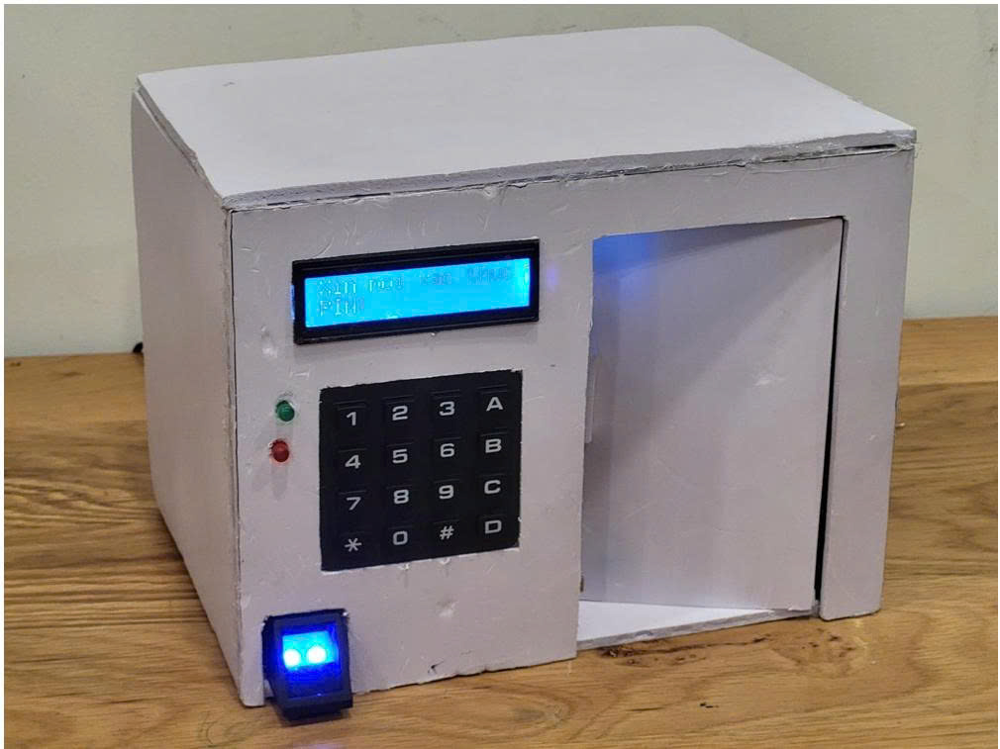
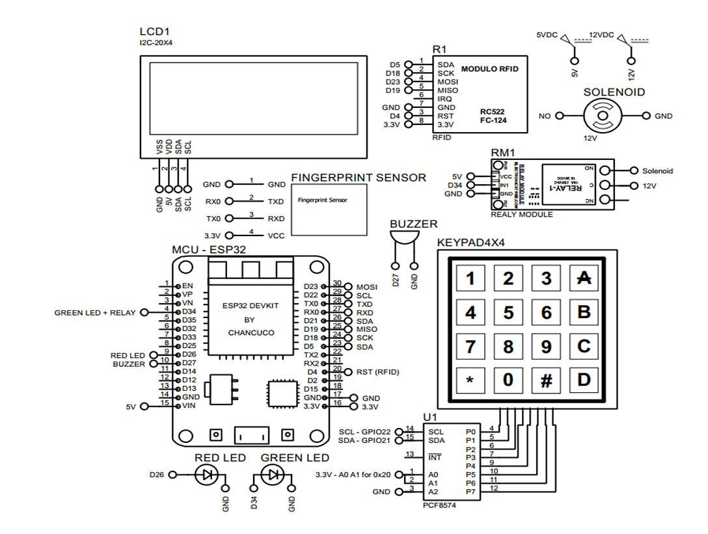
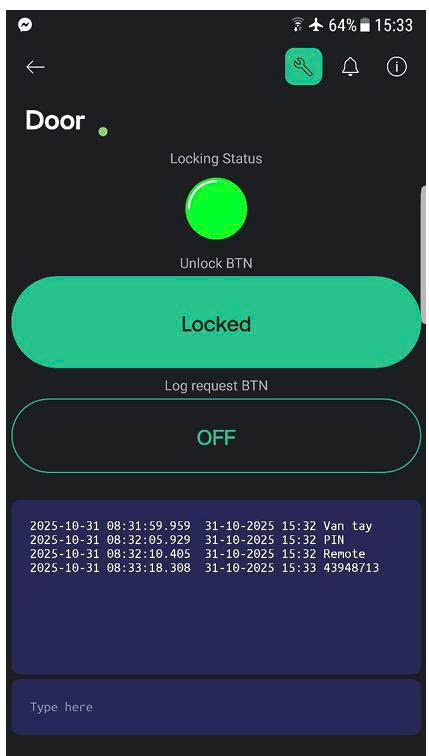

# 🔐 Multi-Auth Smart Door Lock

> An ESP32-based smart door lock system supporting 4 authentication methods: Fingerprint, RFID, PIN Keypad, and Blynk remote control.

---

## 📖 Overview

This project implements a **multi-authentication smart door lock** using an **ESP32 microcontroller**. Users can unlock the door through any of four methods — fingerprint scan, RFID card, PIN code via keypad, or remotely via the **Blynk IoT app**. The system provides real-time feedback through an **LCD display**, **LED indicators**, and a **buzzer**, while all unlock events are logged and viewable in the Blynk app.

**Key Features:**
- 👆 **Fingerprint** — biometric authentication via fingerprint sensor
- 📡 **RFID** — contactless card/tag authentication (RC522)
- 🔢 **PIN Keypad** — 4×4 keypad for password-based entry
- 📱 **Blynk App** — remote unlock and real-time event log via WiFi
- 🔒 **Solenoid lock** — controlled via relay module (12V)
- 📟 **LCD I2C 20×4** — displays current mode and status
- 🟢🔴 **LED + Buzzer** — visual and audio feedback on access granted/denied

---

## 🧰 Hardware Components

| Component | Role |
|-----------|------|
| ESP32 DevKit | Main microcontroller (WiFi + logic) |
| Fingerprint Sensor | Biometric authentication |
| RFID RC522 (FC-124) | Card/tag authentication |
| 4×4 Keypad | PIN code input |
| LCD I2C 20×4 (PCF8574) | Status display |
| Relay Module | Controls solenoid lock |
| Solenoid Lock (12V) | Physical door lock actuator |
| Buzzer | Audio feedback |
| Green / Red LED | Visual access indicator |

---

## 📷 Hardware Model

<p align="center">
  
</p>

The physical prototype is built inside a **cardboard box** simulating a door enclosure. The front panel features a **4×4 keypad** for PIN entry, a **20×4 LCD screen** (blue backlight) showing the current authentication mode and status, and **green/red LED indicators** for access feedback. The **fingerprint sensor** (blue LED, bottom-left) is mounted at the base. The door panel opens via a **solenoid lock** mechanism when authentication succeeds.

---

## 📐 System Diagram

<p align="center">
  
</p>

**Key connections:**

| Module | ESP32 Pins |
|--------|-----------|
| RFID RC522 | D5 (SDA), D18 (SCK), D23 (MOSI), D19 (MISO), D4 (RST) |
| Fingerprint Sensor | RX0 (TXD), TX0 (RXD), 3.3V |
| LCD I2C (PCF8574) | GPIO22 (SCL), GPIO21 (SDA) |
| Keypad 4×4 | D12, D13, D14, D15, D2, D5, TX2, D27 |
| Relay (Solenoid) | D34 |
| Green LED | D34 |
| Red LED + Buzzer | D26, D27 |

The **solenoid lock** is powered at **12V** through the relay module. The relay is triggered by the ESP32 when any authentication method succeeds.

---

## 📱 Blynk App

<p align="center">
  
</p>

The **Blynk dashboard** provides remote monitoring and control:
- **Locking Status** — LED indicator (green = unlocked, off = locked)
- **Unlock BTN** — remotely unlock the door from anywhere
- **Log request BTN** — fetch the latest access log
- **Event log terminal** — displays timestamped unlock events with method used (Van tay / PIN / Remote / RFID card ID)

---

## 🎬 Demo Video

[](https://www.youtube.com/watch?v=X4jNrk7diMk)

---

## 🔧 Software Stack

| Layer | Technology |
|-------|-----------|
| Firmware | C++ (Arduino / PlatformIO for ESP32) |
| Remote Control | Blynk IoT platform (WiFi) |
| Libraries | Adafruit Fingerprint, MFRC522 (RFID), Keypad, LiquidCrystal I2C, BlynkSimpleEsp32 |

---

## 🚀 Getting Started

### 1. Flash ESP32 Firmware

Open `SmartDoor/src/` in Arduino IDE or PlatformIO. Configure the following in the source file:

```cpp
#define BLYNK_AUTH_TOKEN "your_blynk_token"
char ssid[] = "your_wifi_ssid";
char pass[] = "your_wifi_password";
```

Then flash to the ESP32 DevKit board.

### 2. Setup Blynk App

- Create a new project in the **Blynk IoT** app
- Add widgets: **LED** (V0 - locking status), **Button** (V1 - unlock), **Button** (V2 - log request), **Terminal** (V3 - event log)
- Copy the Auth Token into the firmware

### 3. Enroll Fingerprints & RFID Cards

- Use the enrollment mode (defined in firmware) to register fingerprints and RFID cards
- Default PIN can be set in `SmartDoor/src/`

---

## 📁 Project Structure

```
├── Image/                  # Hardware photos and diagrams
│   ├── hardware.jpg
│   ├── system_diagram.jpg
│   └── blynk.jpg
├── SmartDoor/
│   └── src/                # ESP32 firmware (Arduino/PlatformIO)
└── README.md
```

---

## 👥 Team

**Nhóm 06** — Embedded Systems & IoT Project

---

## 📄 License

This project is developed for educational purposes.
